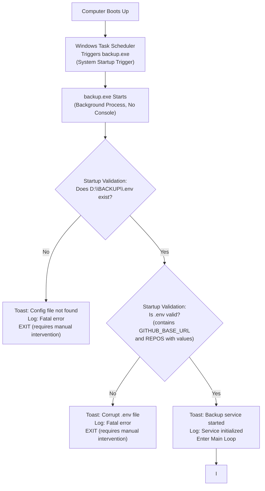
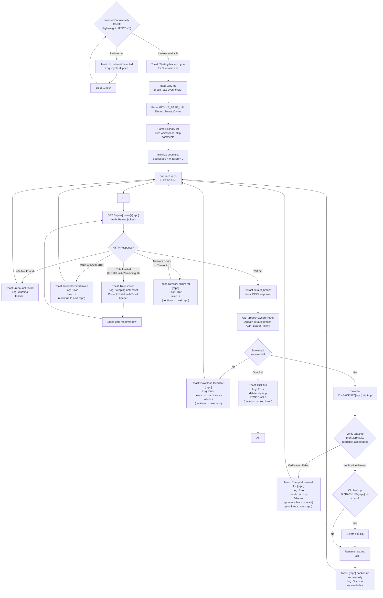
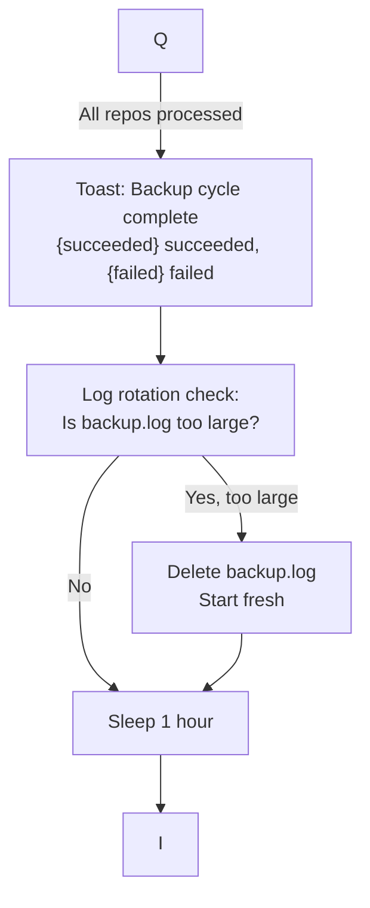

# Data Flow — GitHub Backup Script

> **Note on configurable defaults:** The file paths shown in this document (e.g., `D:\BACKUP\`) are the default deployment location, configurable at runtime via the `BACKUP_DIR` variable in `.env`. The cycle timing shown as "1 hour" is the default interval, configurable via `CYCLE_INTERVAL_SECONDS` in `.env`. See `env.example` for the full list of configurable parameters.

## System Startup Flow

## Main Loop — Hourly Cycle

## Cycle Complete and Sleep

## Data Flow Summary

### Input Sources

| Source | Data | When Read |
|--------|------|-----------|
| `D:\BACKUP\.env` | `GITHUB_BASE_URL` (token + owner) | Once at startup for validation, then fresh every cycle |
| `D:\BACKUP\.env` | `REPOS` (comma-separated repo names) | Fresh every cycle |
| GitHub API | `default_branch` field | Once per repo per cycle |
| GitHub API | Zip archive bytes | Once per repo per cycle |
| GitHub API | `X-RateLimit-Remaining` header | Every API response |
| GitHub API | `X-RateLimit-Reset` header | When rate-limited |

### Output Destinations

| Destination | Data Written | When |
|-------------|-------------|------|
| `D:\BACKUP\{repo}.zip` | Repository zip archive | After successful download + verify + atomic rename |
| `D:\BACKUP\{repo}.zip.tmp` | Temporary download buffer | During download (deleted on failure or after rename) |
| `D:\BACKUP\backup.log` | Structured log entries (timestamp, action, repo, status, error) | Every event |
| Windows Toast | Notification (action, repo, status, timestamp, error details) | Every event |
| `D:\BACKUP\.env` | Never written (read-only) | N/A |

### Data Transformations

| Step | Input | Transformation | Output |
|------|-------|---------------|--------|
| Config parse | `.env` raw text | Extract token (before `@`), owner (after `github.com/`), repo list (split + trim) | Token string, owner string, repo name array |
| API call | Token + owner + repo name | Construct `Authorization: Bearer {token}` header, build endpoint URL | HTTP request |
| JSON parse | API response body | Extract `default_branch` field value | Branch name string |
| Zip download | Zip bytes from API response | Stream to temporary file on disk | `.zip.tmp` file |
| Verify | `.zip.tmp` file on disk | Check file size > 0, attempt read, check accessible | Pass/fail boolean |
| Atomic swap | `.zip.tmp` (verified) + old `.zip` (optional) | Delete old `.zip`, rename `.tmp` to `.zip` | Final `.zip` backup |

### Error Flow Branches

| Error Type | Detection Point | Script Behavior | User Feedback |
|------------|----------------|-----------------|---------------|
| `.env` missing | Startup validation | EXIT | Toast + Log |
| `.env` corrupt | Startup validation | EXIT | Toast + Log |
| No internet | Connectivity check (pre-cycle) | Skip cycle, sleep 1h | Toast + Log |
| Invalid/expired token | API response (401/403) | Continue to next repo | Toast + Log |
| Repo not found (404) | API response | Skip repo, continue | Toast + Log |
| Rate limited (429) | API response headers | Sleep until reset, retry | Toast + Log |
| Network failure | API call timeout/error | Continue to next repo | Toast + Log |
| Download failure | HTTP error / incomplete | Delete .tmp, continue | Toast + Log |
| Corrupt download | Post-download verification | Delete .tmp, continue | Toast + Log |
| Disk full | Write operation failure | Delete .tmp, stop cycle | Toast + Log |
